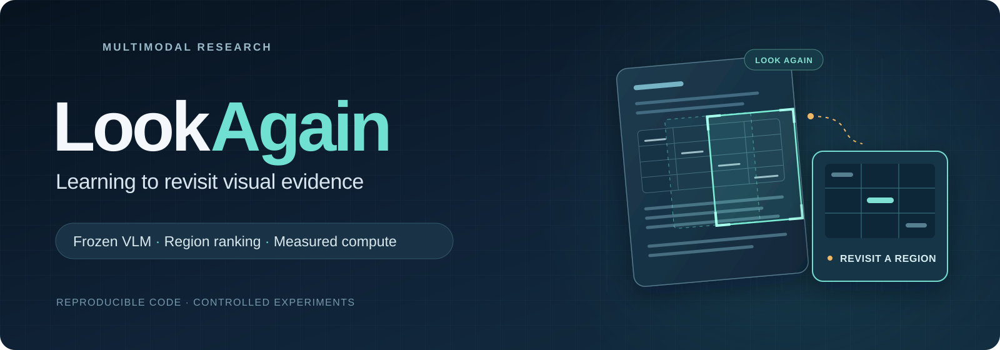
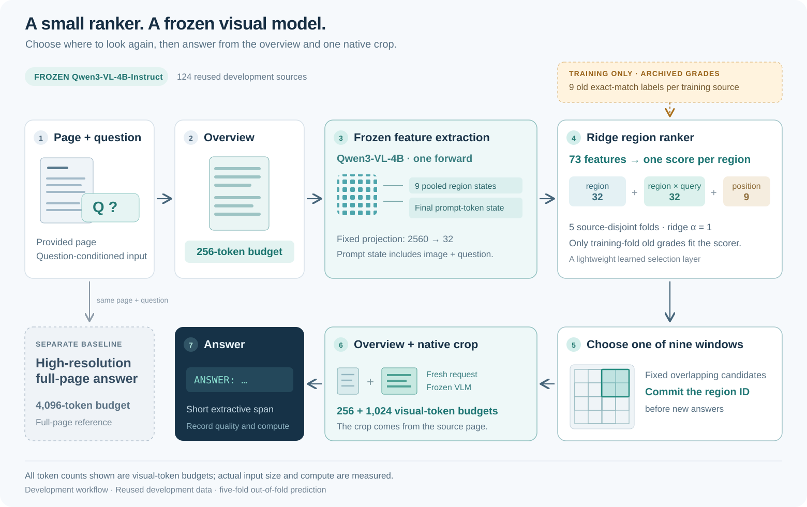
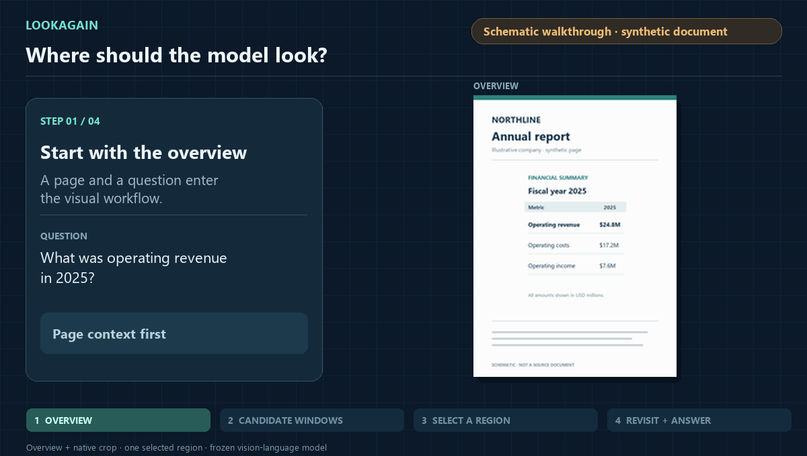
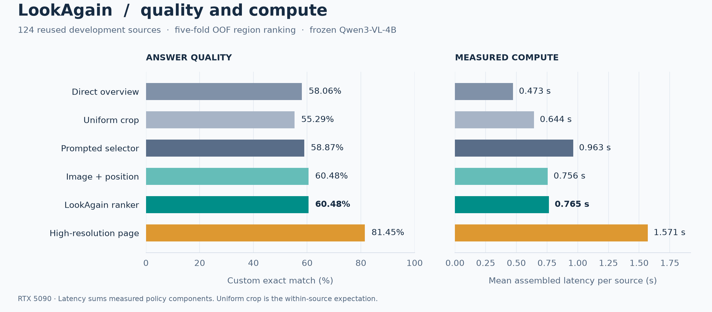

<p align="center">
  
</p>

<h1 align="center">LookAgain</h1>

<p align="center">
  <strong>Controlled visual re-observation and learned region ranking for frozen vision-language models.</strong>
  <br>
  Computer vision · multimodal representations · document understanding · reproducible evaluation
</p>

<p align="center">
  <a href="https://github.com/RenataLi/LookAgain/actions/workflows/tests.yml"></a>
  
  
  
  <a href="LICENSE"></a>
</p>

<p align="center">
  <a href="#research-question">Research question</a> ·
  <a href="#method">Method</a> ·
  <a href="#measured-results">Results</a> ·
  <a href="#quick-start">Quick start</a> ·
  <a href="#reproducibility">Reproducibility</a>
</p>

---

## Research question

> Where should a vision-language model look, and what does another view actually add?

LookAgain combines a frozen **Qwen3-VL-4B-Instruct** backbone with a **73-feature ridge ranker**.
A single overview forward supplies features for nine candidate windows. The ranker chooses
one window, and the VLM answers from the overview plus its native-resolution crop.

The experiments compare image detail, region choice and answer extraction using paired
inputs. Each policy is evaluated for answer quality and measured computation cost.

## What is implemented

| Component | Implementation |
| --- | --- |
| Frozen multimodal inference | Pinned Qwen3-VL weights, processor, chat templates, BF16 and SDPA |
| Learned region ranking | Spatial pooling, fixed projection, query interactions, ridge fitting and ablations |
| Controlled visual inputs | Matched source-detail and overview-derived crops, fixed grids and resolution budgets |
| Experimental design | Source-level splits, prospective choices, paired outcomes and explicit development/evaluation roles |
| Compute accounting | Measured preprocessing, feature extraction, selector/ranker cost, answer generation and memory |
| Reproducible evidence | Numerical score and cost data, fitted coefficients, CPU tests and metric replay |

The [evidence index](reports/README.md) summarizes eight completed experiments, from
visual-detail controls to learned ranking. The [research note](reports/research_note.md)
describes the latest extraction-and-ranking study.

## Method

<p align="center">
  
</p>

1. **Encode the overview.** A frozen decoder forward processes the low-resolution page and
   question prompt. Spatial pooling produces one vector per candidate; the final prompt-token
   state supplies the query representation.
2. **Build compact features.** A fixed Gaussian projection maps the 2,560-dimensional vectors
   to 32 dimensions, followed by L2 normalization. Each candidate combines its region vector,
   an elementwise region–query interaction, and a nine-way position code.
3. **Rank the regions.** A ridge model scores all nine candidates. Training centers features and
   binary answer grades within each source, with training-only RMS scaling and fixed regularization.
4. **Answer from the selected view.** A fresh request contains the original overview and selected
   native crop. The answer uses the same frozen backbone and a fixed extraction instruction.

**73 features per candidate:** region[32] + region × query[32] + position[9].

Candidates overlap on a 3×3 grid; each spans half the page width and height, at most 25% of its
area. Overview/crop/high-resolution budgets are 256/1024/4096 visual tokens. The final prompt
state represents the whole request, including the image and instructions, rather than a pure
question embedding. The [model description](docs/refinement_model.md) specifies pooling,
projection, normalization and the exact training objective.

Reference answers, OCR text and evidence-box coordinates are excluded from selection inputs.
Dataset annotations supply the answer page. The trained component ranks regions; the broader
research question also includes when re-observation is worth its cost.

### Schematic walkthrough

<p align="center">
  
</p>

*Schematic walkthrough on an original synthetic page. Experimental metrics are reported
separately below.*

## Measured results

The latest panel combines 64 former development and 60 former evaluation sources as **reused
development data**. Five source folds contain 25/25/25/25/24 examples. Rankers use only archived
old crop-answer grades; every out-of-fold region choice was committed before new answers were
generated. Both answer-instruction versions use those same region IDs.

| Policy with the revised instruction | Exact matches / 124 | Custom EM | Scalar ANLS | Mean assembled time |
| --- | ---: | ---: | ---: | ---: |
| Direct overview | 72 | 58.06% | 0.73671 | 0.473 s |
| Uniform expected crop | 68.556 expected | 55.29% | 0.68723 | 0.644 s |
| Prompted region selector | 73 | 58.87% | 0.71731 | 0.963 s |
| Image + position ridge | 75 | **60.48%** | 0.73386 | **0.756 s** |
| Full ridge with query interaction | 75 | **60.48%** | 0.72781 | **0.765 s** |
| High-resolution full page | 101 | **81.45%** | **0.87989** | 1.571 s |



On this development panel, full ranking adds **+1.613 percentage points** over prompted
selection with **20.57% lower** mean assembled time. Image+position matches the full model's EM,
and high resolution provides the strongest accuracy baseline.

Custom EM preserves punctuation and units while collapsing case and whitespace; scalar ANLS
provides a second quality measure. The [research note](reports/research_note.md)
summarizes feature ablations, fold-level results, paired transitions and instruction comparisons.

Per-source times sum the measured feature, CPU ranking, selector and answer components
required by each policy. Measurements were collected on an RTX 5090 on an active desktop;
the reported policy times are assembled estimates.

## Evidence behind the selector

| Study | Design | Main observation |
| --- | --- | --- |
| Visual-detail replication | 660 DUDE source clusters; same region, language and processor grid | Native-detail EM 67.12% versus overview-derived 64.24%; paired difference +2.879 pp |
| Prompted region selection | 60 source-disjoint evaluation clusters; nine fixed candidates | Selected EM 56.67% versus uniform expectation 54.07%; interval for the difference [−2.78, +8.70] pp |
| Extraction + learned ranking | 124 reused development sources; five-fold OOF | Full and image+position EM 60.48%; measured quality/cost and instruction ablations |

The detail study uses annotation-guided page and ROI selection. Later selectors replace the
ROI annotation with fixed geometry and predicted choices while retaining the supplied page.

## Quick start

Verify the published results on CPU, from the repository root with Python 3.11 or newer:

```bash
git clone https://github.com/RenataLi/LookAgain.git
cd LookAgain
python scripts/reproduce_results.py
```

The lightweight path recomputes policy metrics, fold results, the fixed-policy prompt interval
and cost accounting from published numerical scores. It uses the Python standard library and
checks **4,806 values** against the expected results. See the [reproduction guide](docs/reproduce.md)
for the data format, checks and model-inference workflow.

### Work with the experiment code

```bash
python -m pip install -e ".[dev]"
python -m pytest tests/test_refinement_ranker.py tests/test_refinement_analysis.py tests/test_refinement_result_check.py
```

For model execution, the [inference guide](docs/running_inference.md) includes a GQA
smoke run with pinned weights and data. The study modules implement source preparation,
feature collection, ridge fitting, generation and input validation.

## Reproducibility

The experiment code records source identities, processor inputs, feature projections, folds,
coefficients and committed choices. The numerical release preserves paired observations and
out-of-fold assignments in a portable format. Fixed configurations specify the model revision,
visual budgets and seeds; the release manifest records the distributed file checksums.

Invalid and truncated answers remain in each denominator. Engineering sources are separate.
Feature-based rankers pay feature-extraction cost; position and fixed-region policies pay their
CPU choice and answer cost. Fitting, warmups and historical timings are accounted for separately.

| Read or inspect | Artifact |
| --- | --- |
| Research interpretation | [Latest research note](reports/research_note.md) |
| Exact design | [Prospective protocol](docs/refinement_protocol.md) |
| Model and feature construction | [Architecture details](docs/refinement_model.md) |
| Fitted full-data rankers | [Model coefficients](artifacts/ranker_coefficients.json) |
| Complete numeric results | [Analysis summary](reports/benchmark/expected_summary.json) |
| Result verification | [Numerical replay](docs/reproduce.md) |
| Full research sequence | [Report index](reports/README.md) |

## Repository map

```text
src/lookagain/    VLM backend, image actions, parsing and shared evaluation
experiments/     controlled studies, feature extraction, training and analysis
configs/         fixed model, input-budget and experiment specifications
reports/         numerical score/cost data, research notes and experiment overview
docs/            research protocols, architecture and reproduction guides
scripts/         result replay, figure generation and experiment utilities
tests/           numerical, data-integrity, input-contract and execution checks
assets/          overview graphics and schematic method walkthrough
```

## Model, data and license

Built with [Qwen3-VL-4B-Instruct](https://huggingface.co/Qwen/Qwen3-VL-4B-Instruct),
PyTorch and Transformers. The study sequence uses [GQA](https://cs.stanford.edu/people/dorarad/gqa/about.html),
[TAT-DQA](https://arxiv.org/abs/2207.11871) and [DUDE](https://arxiv.org/abs/2305.08455).
Each experiment records its particular source selection and evaluation role.

Code uses the [MIT License](LICENSE); datasets and model weights retain their original licenses.
Source documents, images, raw OCR and weights are obtained upstream. The repository includes
per-source numerical scores and cost observations for metric replay, plus the learned ranker coefficients.
